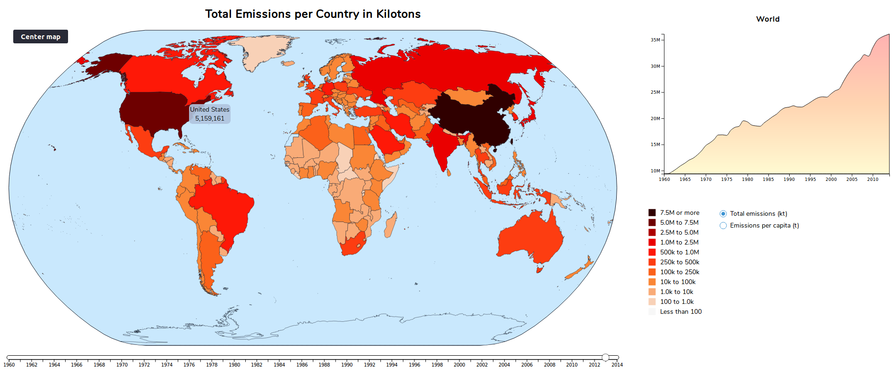

Assignment 4 - Remix
===

[Original visualization](https://www.reddit.com/r/dataisbeautiful/comments/alr6jt/countries_scaled_by_total_co2_emissions_1971_to/)

[Remixed visualization](https://jpcaltabiano.github.io/04-Remix/)

I chose a visualization showing total CO2 emissions per country, and per capita per country. I felt that scaling country size did not convery the data well and that the timing of the animation was too fast and inconsistent. I also wanted to see the total emissions bar on the left as a static chart. I remixed this vizulalization by creating one static map with an option to select wether to view total emissions or emissions per capita. I also added a supplemental chart to show emissions either globally or per country, and either total or per capita. 

### Design Achievements
I focused on expanding interactivability as much as possible, to make viewing intuitive and to make seeing all the data easier. I included tooltips that follow your mouse that display the name of the country and the current value for that country. I also included functions that change the chart when you click on a country to show the data for that country. Clicking anywhere else will show the total for the world again. (NOTE -- The feature where you can click on the oceans to show the world data again sometimes does not work. It has the chance to load after the map is loaded, removing the on click function. Ideally this would be set asynchronously, but I was unable to get this to work in time as I found the bug soon before the deadline.) The slider below the map allows the user to move through time at their own pace, and gives them the ability to compare two distant years at a click. The user can also choose to see either a map and chart of the total emissions, or of the emissions per capita using the selections on the right. Additionally, I feel that my color scaling is a design achievement. I experimented with many different color combos but decided to stick with my original white-orange-red-black scale. I separated the data into different custom-sized bins, which turned out to be a good compromise between a linear and a log scale. This allowed me to highlight changes in data over time as well as comparisons between countries when the data had a very wide variance. 

### Tech Achievements
My tech achievements cetnered around making my interactive design achievements possible. I had to pay attention to generation and scaling of my map, and worked for some time to figure out how to render an outline of my oval natrual earth projection. Creating the linkages that allows for changing the chart on a country click, and changing the map type on the selection is also a tech achievement. I had to devise an efficient way to pass the csv data around, as well as clear and rerender elements. To avoid this I ended up rendering most things, and simply changing the opacity when desired. I also spend a lot of time trying to polish the layout of the webpage. I am new to CSS so this took some time, but eventually I got what I was aiming for. I found that certain attributes were required in order for elements to scale depending on the size of the page, and I found how to decalre the size attributes to accomodate this. 

Slider code source: 
https://bl.ocks.org/shashank2104/d7051d80e43098bf9a48e9b6d3e10e73
